# Orbit2Cabin ✈️📡 — Aircraft Connectivity via LEO Satellite Mesh (Starlink-style)

A reference architecture + system design for delivering **gate-to-gate onboard internet** to a **commercial aircraft** using a **LEO satellite constellation** with **inter-satellite links** (space mesh), bridging signals from **ground networks** to **satellites**, then to the **aircraft terminal**, and finally to **passengers onboard**.

> **Use-case**: A British Airways-style onboard Wi‑Fi experience where customers can browse, message, stream, work, and receive real-time travel updates — especially valuable during disruption


<details>
  <summary style="opacity: 0.85;"><b>Why this repo ?</b></summary><br>
  <div style="display: flex; align-items: center; gap: 10px;" align="center">


</br>


</details>

---

## What This Repo Covers

- High-level architecture for aircraft internet using LEO satellites
- A practical system design: networking, routing, QoS, authentication, telemetry
- Both **high-level** and **low-level** designs using **Mermaid diagrams**
- Operational considerations: reliability, security, observability, and incident handling
- Optional simulation approach for latency/throughput modeling

---

## ✅ Goals

1. **Reliable Gate-to-Gate Connectivity**  
   Maintain continuous onboard connectivity from boarding to arrival.

2. **Operational Resilience**  
   Support real-time decision making during disruption: missed connections, rebooking, and customer care.

3. **Passenger Experience**  
   Seamless login, stable sessions, adaptive QoS, and smooth handover.

4. **Safety + Security**  
   Strong isolation between aircraft operational systems and passenger network; secure authentication and encryption.

---

## Non-Goals 🚧 (Out of Scope)

- Avionics and flight-critical system integration.
- Exact vendor-specific Starlink implementation details.
- Regulatory certification processes.

---

## Core Concept

**Ground Network → LEO Gateway Uplink → LEO Satellite → Inter-Satellite Mesh → LEO Satellite Downlink → Aircraft Terminal → Onboard Wi‑Fi Router → Passenger Device**

---

## High-Level Architecture (HLD)

### 1) System Context


</br>

## Component Design (HLD)

```mermaid
flowchart TB
  subgraph Aircraft["Aircraft Network Domain"]
    AP[Wi‑Fi APs] --> GW1[Cabin Gateway]
    GW1 --> CP[Captive Portal + Auth]
    CP --> QOS[QoS/Traffic Shaping]
    QOS --> FW[Firewall + NAT]
    FW --> SAT[Satellite Modem/Terminal]
    CREW[Crew Service Apps] --> GW1
  end

  subgraph Space["Space Domain (LEO)"]
    SAT --> LEO1[LEO Satellite]
    LEO1 --> LEO2[LEO Mesh Routing]
    LEO2 --> LEO3[LEO Satellite]
  end

  subgraph Ground["Ground Domain"]
    LEO3 --> GWS[Gateway Station]
    GWS --> POP[Edge POP / CDN]
    GWS --> NET[Public Internet]
    GWS --> OPS[Airline Ops + Customer Care APIs]
    OBS[Telemetry + Monitoring] <---> GWS
    OBS <---> SAT
  end

  NET --> APPS[Third-party apps/services]
```


</br>

## Key Design Decisions (Why this architecture works)

#### A) QoS Matters More Than Raw Bandwidth
Passenger networks can saturate quickly. A premium experience prioritizes:

- Airline critical services (rebooking, connection updates).
- Messaging + email.
- Voice/video (optional policies).
- Streaming with adaptive bitrate (ABR) + caching.

#### B) Seamless Identity + Session Continuity

- Captive portal handles authentication.
- Token-based sessions reduce re-auth during handovers.
- Device roaming managed locally with stable IP/Session mapping.

#### C) Strong Network Isolation

- Passenger traffic is isolated from crew/ops and any aircraft operational domains.
- Firewall rules and strict segmentation (VLANs, VRFs).
- Least privilege for service APIs.

</br>

## Low-Level Design (LLD)

1) Network Segmentation (Aircraft)


#### Policy example (conceptual):

- Crew traffic gets higher priority than passenger bulk traffic.
- Airline disruption APIs always available (even if bandwidth constrained).

</br>

## 2) Auth Flow (Captive Portal + Token)


</br>

## 3) Satellite Handover (Session Stability)


</br>

## 4) Data Plane vs Control Plane


</br>

## Plan Structure

```yaml
skymesh-connect/
├─ README.md
├─ docs/
│  ├─ architecture.md
│  ├─ security.md
│  ├─ qos-policy.md
│  ├─ observability.md
│  └─ disruption-playbook.md
├─ diagrams/
│  ├─ hld.mmd
│  ├─ lld-auth.mmd
│  ├─ lld-handover.mmd
│  └─ deployment.mmd
├─ simulation/                 # optional
│  ├─ latency_model.ipynb
│  └─ throughput_model.ipynb
└─ examples/
   ├─ sample-qos-policy.yaml
   └─ sample-session-rules.json
```

</br>

## Security Model 🔐 (Practical)
#### Threats we design for

- Unauthorized access to onboard network.
- Lateral movement between passenger and crew networks.
- Man-in-the-middle attempts (rogue APs).
- Abuse of bandwidth (DoS / heavy downloads).
- Credential stuffing on captive portal.

#### Controls

- WPA2/WPA3 + captive portal + short-lived tokens.
- Network segmentation (Passenger/Crew/Mgmt).
- Zero-trust access to airline APIs (mTLS + scoped tokens).
- Rate limiting + anomaly detection.
- Encrypted backhaul (satellite link encryption + TLS at app layer).


## Observability & Operations
#### What we monitor

- Link quality (SNR, beam handover frequency).
- Packet loss, RTT, jitter (per aircraft + per session tier).
- DNS failures, auth failures, session drops.
- QoS queue depth and shaping effectiveness.
- Customer-impact score (derived metric).

## Telemetry Flow


## “Real-Life Problem Solved” (What changes onboard)
#### Starlink-style mesh connectivity enables:

- Real-time disruption support: customers can handle connections and changes mid-air.
- Fewer Wi‑Fi complaints: consistent performance and easier troubleshooting.
- IFE fallback: if seatback entertainment fails, customers can stream on their own devices.
- Crew enablement: better access to support teams and operational tools (when permitted).

---

</br>
</br>

<div style="display: flex; align-items: center; gap: 10px;" align="center">
  
# ⭐ Working on this repo. [**`Come later`**](https://www.linkedin.com/in/akashdip2001/) ⭐
</div>

</br>
</br>
</br>
